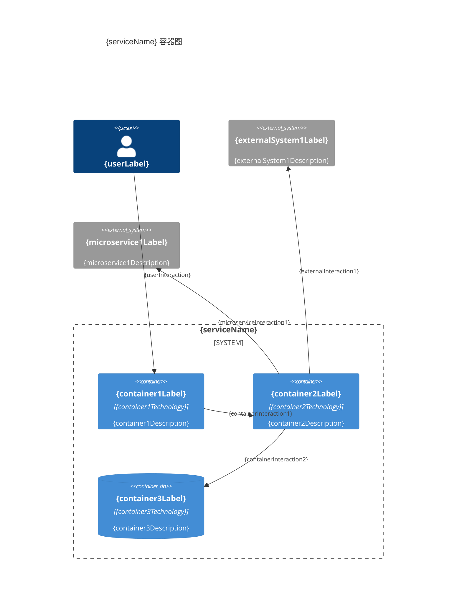
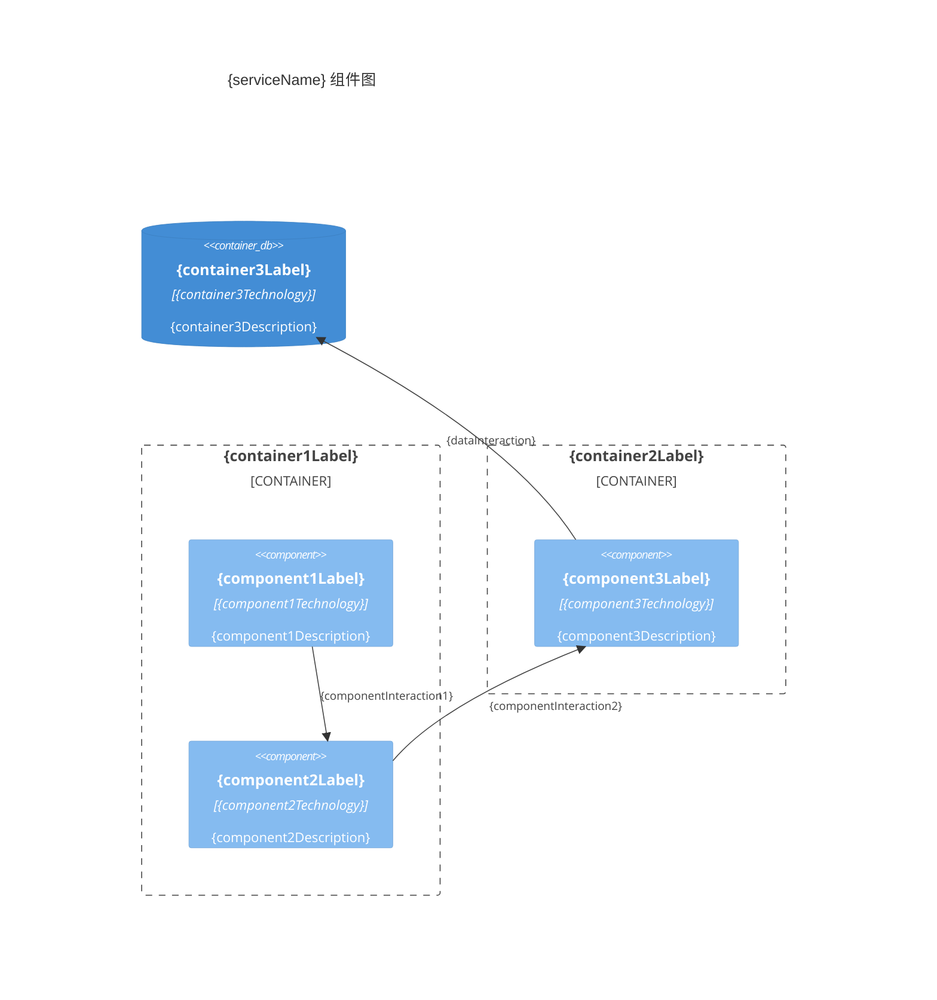
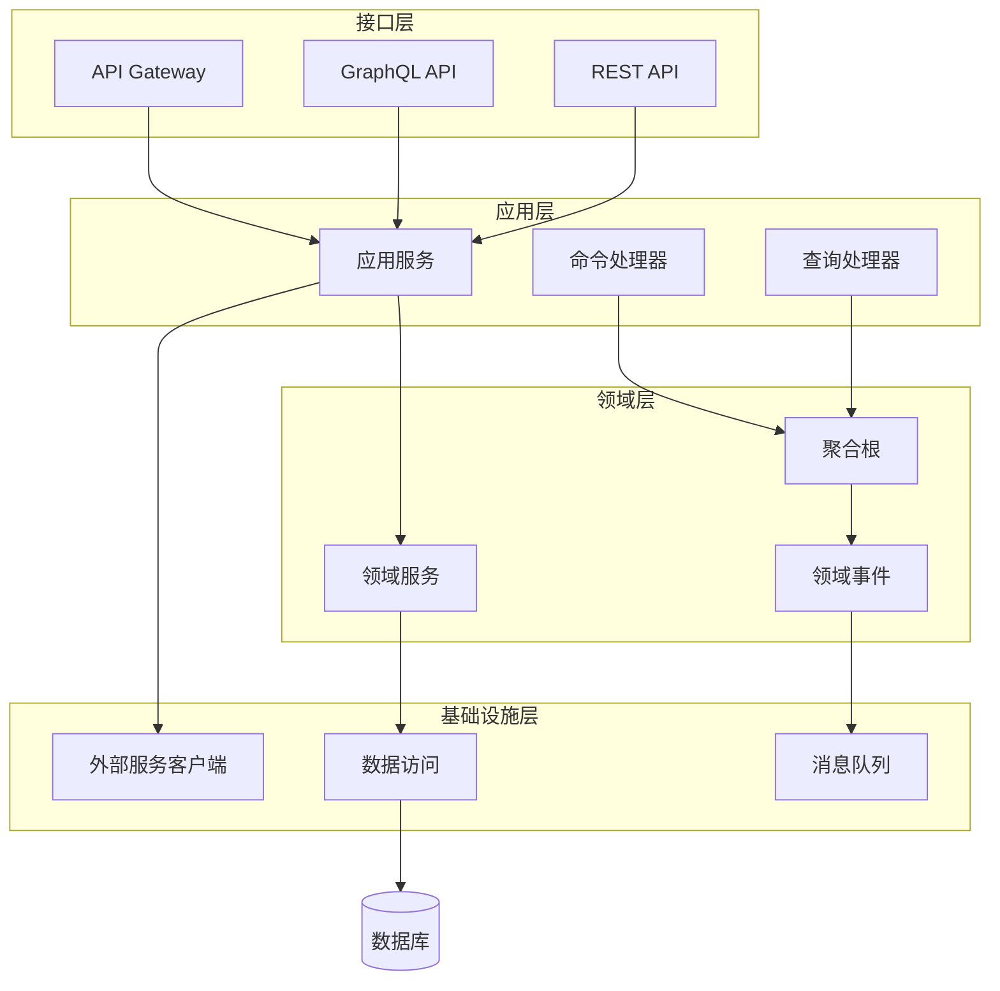

# {serviceName} 架构概览

**创建日期**: {date:-2026-03-16}
**架构师**: {architect}
**版本**: {version:-1.0}

## 概述

**技术栈与选型以本文为准。**

本文档描述 {serviceName} 微服务的整体架构，包括容器图（C4 Level 2）和组件图（C4 Level 3）。系统级技术依赖见本文「系统依赖（技术）」小节。

## 架构原则

1. **{principle1}**: {principleDescription1}
2. **{principle2}**: {principleDescription2}
3. **{principle3}**: {principleDescription3}

## 容器图（C4 Level 2）

### 容器清单

| 容器名称       | 技术            | 职责                | 状态        |
| -------------- | --------------- | ------------------- | ----------- |
| {container1}   | {technology1}   | {responsibility1}   | {status1}   |
| {container2}   | {technology2}   | {responsibility2}   | {status2}   |
| {container3}   | {technology3}   | {responsibility3}   | {status3}   |

### 容器图

## 系统依赖（技术）

| 依赖类型            | 依赖名称            | 描述                       | 是否必需                |
| ------------------- | ------------------- | -------------------------- | ----------------------- |
| {dependencyType1}   | {dependencyName1}   | {dependencyDescription1}   | {dependencyRequired1}   |
| {dependencyType2}   | {dependencyName2}   | {dependencyDescription2}   | {dependencyRequired2}   |

## 组件图（C4 Level 3）

### 组件清单

| 组件名称       | 职责                | 所属容器       |
| -------------- | ------------------- | -------------- |
| {component1}   | {responsibility1}   | {container1}   |
| {component2}   | {responsibility2}   | {container2}   |
| {component3}   | {responsibility3}   | {container2}   |

### 组件图

## 分层架构

### 架构层次

{layeredArchitectureDescription}

### 分层架构图

## 技术选型

> **说明**: 技术栈与选型以本文为准。详见下表。

| 层次       | 技术栈         | 选型理由       |
| ---------- | -------------- | -------------- |
| {layer1}   | {techStack1}   | {rationale1}   |
| {layer2}   | {techStack2}   | {rationale2}   |

## 数据流

{dataFlowDescription}

## 安全边界

{securityBoundaryDescription}

## 相关文档

- [[01-service-overview.md]] - 服务概览（业务与系统上下文）
- [[03-directory-structure.md]] - 目录结构
- [[../03-domains/01-overview/01-domains-overview.md]] - 领域概览

## 变更记录

| 日期     | 版本 | 变更内容 | 变更人        |
| -------- | ---- | -------- | ------------- |
| {date}   | 1.0  | 初始版本 | {architect}   |
