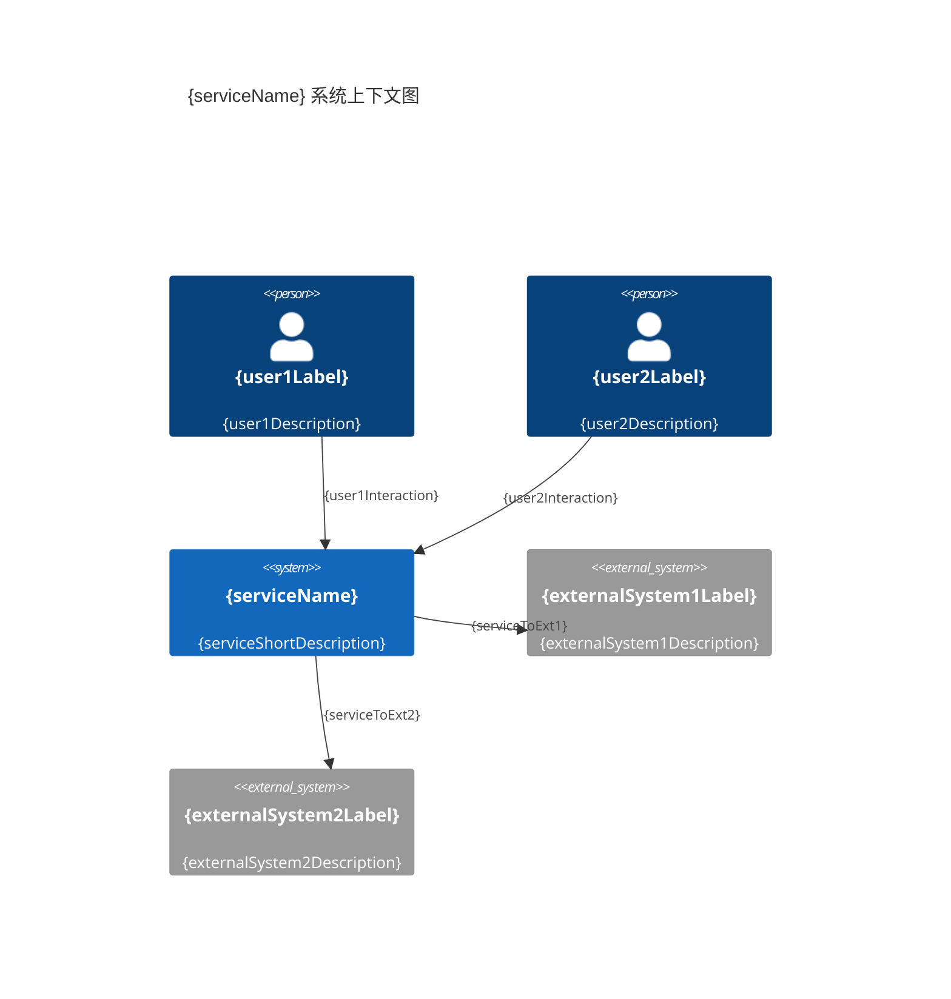

# {serviceName} 服务概览

**创建日期**: {date:-2026-03-16}
**架构师**: {architect}
**版本**: {version:-1.0}

> **说明**: 本文档面向**产品/业务**，描述服务与系统上下文；技术架构与技术栈见 [[02-architecture.md]]。

## 概述

{serviceDescription}

## 服务定位

### 业务定位

{businessPosition}

技术实现见 [[02-architecture.md]]。

## 服务职责与边界

### 核心职责

{coreResponsibilities}

### 职责边界

{responsibilityBoundaries}

## 系统上下文

### 系统用户

| 用户类型      | 描述                 | 交互方式               |
| ------------- | -------------------- | ---------------------- |
| {userType1}   | {userDescription1}   | {interactionMethod1}   |
| {userType2}   | {userDescription2}   | {interactionMethod2}   |

### 能力依赖

{capabilityDependencies}

技术级依赖见 [[02-architecture.md#系统依赖（技术）]]。

### 系统上下文图

### 关键交互

1. {keyInteraction1}
2. {keyInteraction2}
3. {keyInteraction3}

## 服务特性与非功能需求（摘要）

### 关键特性

{keyFeatures}

### 非功能性需求

- **性能**: {performanceRequirement}
- **可用性**: {availabilityRequirement}
- **可扩展性**: {scalabilityRequirement}
- **安全性**: {securityRequirement}

## 相关文档

- [[../02-product/01-prd.md]] - 产品需求与路线图
- [[../02-product/02-features.md]] - 功能规格说明
- [[../02-product/03-ux-and-metrics.md]] - 体验设计与产品指标
- [[02-architecture.md]] - 架构概览（含技术栈与选型）
- [[03-directory-structure.md]] - 目录结构
- [[../03-domains/01-overview/01-domains-overview.md]] - 领域概览

## 变更记录

| 日期     | 版本        | 变更内容 | 变更人        |
| -------- | ----------- | -------- | ------------- |
| {date}   | {version}   | 初始版本 | {architect}   |
