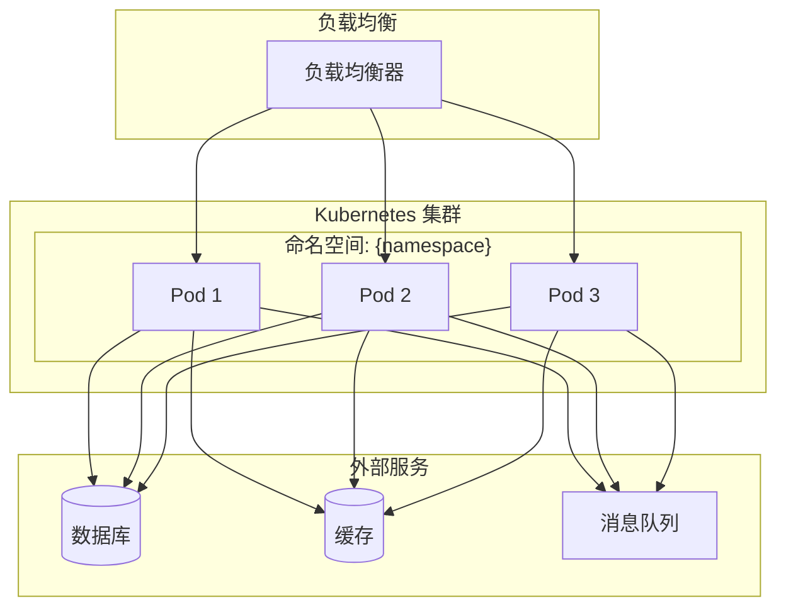

# {serviceName} 部署架构

**创建日期**: {date:-2026-03-16}
**运维工程师**: {opsEngineer}
**版本**: {version:-1.0}

## 概述

本文档描述 {serviceName} 微服务的部署架构，包括 Kubernetes 配置、环境管理和部署策略。

## 部署架构图



## Kubernetes 配置

### 命名空间

```yaml
apiVersion: v1
kind: Namespace
metadata:
  name: {namespace}
```

### Deployment 配置

```yaml
apiVersion: apps/v1
kind: Deployment
metadata:
  name: {serviceName}
  namespace: {namespace}
spec:
  replicas: {replicas:-3}
  selector:
    matchLabels:
      app: {serviceName}
  template:
    metadata:
      labels:
        app: {serviceName}
    spec:
      containers:
      - name: {serviceName}
        image: {imageName}:{imageTag}
        ports:
        - containerPort: {containerPort:-8080}
        env:
        - name: ENVIRONMENT
          value: "{environment}"
        resources:
          requests:
            memory: "{memoryRequest:-512Mi}"
            cpu: "{cpuRequest:-500m}"
          limits:
            memory: "{memoryLimit:-1Gi}"
            cpu: "{cpuLimit:-1000m}"
        livenessProbe:
          httpGet:
            path: {livenessPath:-/health}
            port: {containerPort:-8080}
          initialDelaySeconds: {livenessDelay:-30}
          periodSeconds: {livenessPeriod:-10}
        readinessProbe:
          httpGet:
            path: {readinessPath:-/ready}
            port: {containerPort:-8080}
          initialDelaySeconds: {readinessDelay:-10}
          periodSeconds: {readinessPeriod:-5}
```

### Service 配置

```yaml
apiVersion: v1
kind: Service
metadata:
  name: {serviceName}
  namespace: {namespace}
spec:
  type: {serviceType:-ClusterIP}
  ports:
  - port: {servicePort:-80}
    targetPort: {containerPort:-8080}
  selector:
    app: {serviceName}
```

### Ingress 配置

```yaml
apiVersion: networking.k8s.io/v1
kind: Ingress
metadata:
  name: {serviceName}
  namespace: {namespace}
  annotations:
    kubernetes.io/ingress.class: "{ingressClass:-nginx}"
spec:
  rules:
  - host: {host}
    http:
      paths:
      - path: {path:-/}
        pathType: Prefix
        backend:
          service:
            name: {serviceName}
            port:
              number: {servicePort:-80}
```

## 环境管理

### 环境列表

| 环境名称 | 命名空间       | 副本数 | 资源配置           | 用途           |
| -------- | -------------- | ------ | ------------------ | -------------- |
| {env1}   | {namespace1}   | {replicas1} | {resources1}     | {purpose1}     |
| {env2}   | {namespace2}   | {replicas2} | {resources2}     | {purpose2}     |

### 环境变量

| 变量名                 | 开发环境           | 测试环境           | 生产环境           | 描述             |
| ---------------------- | ------------------ | ------------------ | ------------------ | ---------------- |
| {var1}                 | {devValue1}        | {testValue1}       | {prodValue1}       | {description1}   |
| {var2}                 | {devValue2}        | {testValue2}       | {prodValue2}       | {description2}   |

## 部署策略

### 滚动更新策略

{rollingUpdateStrategy}

### 蓝绿部署策略

{blueGreenStrategy}

### 金丝雀部署策略

{canaryStrategy}

## 监控与告警

### 监控指标

{monitoringMetrics}

### 告警规则

{alertRules}

## 相关文档

- [[observability]] - 可观测性配置
- [[sre]] - SRE 设计
- [[environments]] - 环境说明

## 变更记录

| 日期     | 版本 | 变更内容 | 变更人         |
| -------- | ---- | -------- | -------------- |
| {date}   | 1.0  | 初始版本 | {opsEngineer}  |
