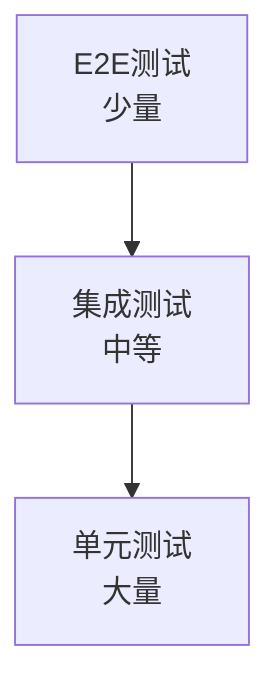
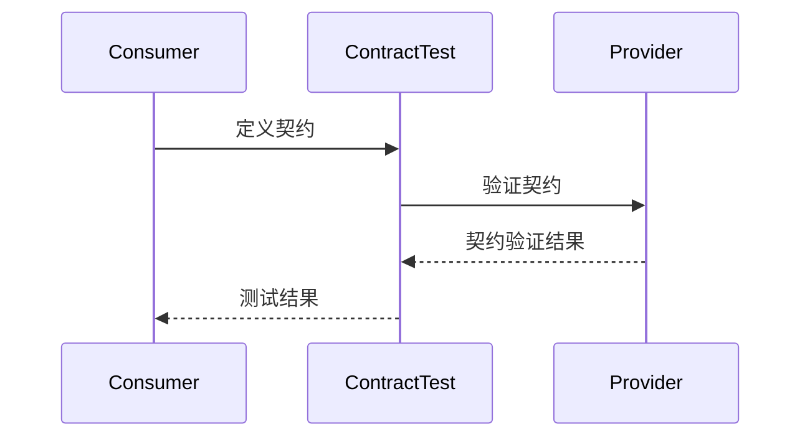

# {serviceName} 测试策略

**创建日期**: {date:-2026-03-16}
**测试工程师**: {tester}
**版本**: {version:-1.0}

## 概述

本文档定义 {serviceName} 微服务的测试策略，包括单元测试、集成测试和契约测试。

## 测试金字塔

### 测试层次

### 测试分布

| 测试类型     | 占比                       | 描述                       |
| ------------ | -------------------------- | -------------------------- |
| 单元测试     | {unitTestPercentage:-70%}  | {unitTestDescription}      |
| 集成测试     | {integrationTestPercentage:-20%} | {integrationTestDescription} |
| 契约测试     | {contractTestPercentage:-5%} | {contractTestDescription} |
| E2E测试      | {e2eTestPercentage:-5%}    | {e2eTestDescription}       |

## 单元测试

### 测试范围

{unitTestScope}

### 测试覆盖率目标

{unitTestCoverageTarget}

### 测试工具

{unitTestTools}

## 集成测试

### 测试范围

{integrationTestScope}

### 测试策略

{integrationTestStrategy}

### 测试工具

{integrationTestTools}

### 测试环境

{integrationTestEnvironment}

## 契约测试

### 测试范围

{contractTestScope}

### 契约定义

{contractDefinition}

### 测试工具

{contractTestTools}

### 契约测试流程

## 性能测试

### 测试类型

{performanceTestTypes}

### 性能指标

| 指标名称           | 目标值      | 测量方法             |
| ------------------ | ----------- | -------------------- |
| {performanceMetric1} | {targetValue1} | {measurementMethod1} |
| {performanceMetric2} | {targetValue2} | {measurementMethod2} |

### 测试工具

{performanceTestTools}

## 安全测试

### 测试范围

{securityTestScope}

### 测试类型

{securityTestTypes}

### 测试工具

{securityTestTools}

## 测试自动化

### CI/CD 集成

{cicdIntegration}

### 测试执行流程

{testExecutionFlow}

## 测试数据管理

{testDataManagement}

## 相关文档

- [[performance_test]] - 性能测试文档
- [[threat_model]] - 威胁建模

## 变更记录

| 日期     | 版本 | 变更内容 | 变更人       |
| -------- | ---- | -------- | ------------ |
| {date}   | 1.0  | 初始版本 | {tester}     |
